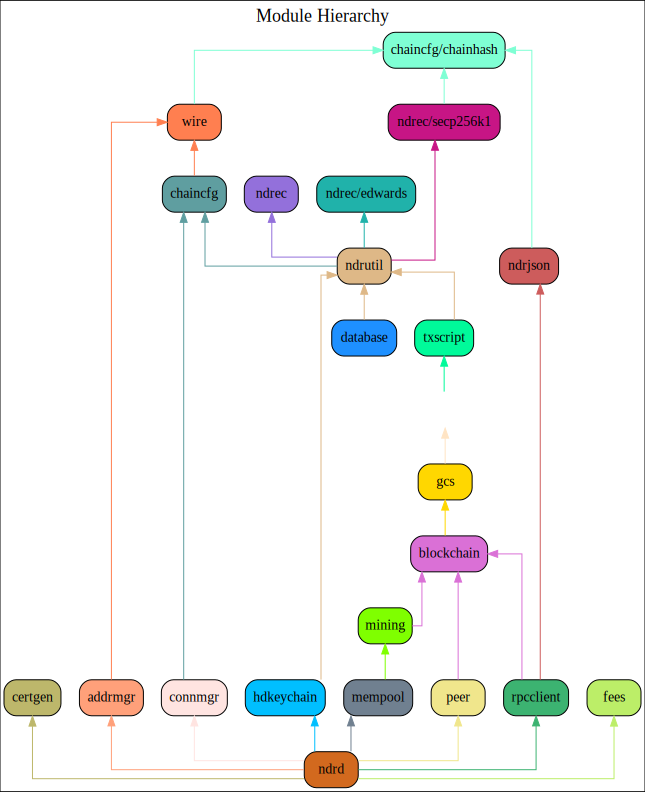

### Table of Contents
1. [About](#About)
2. [Getting Started](#GettingStarted)
    1. [Installation](#Installation)
    2. [Configuration](#Configuration)
    3. [Controlling and Querying ndrd via dcrctl](#DcrctlConfig)
    4. [Mining](#Mining)
3. [Help](#Help)
    1. [Network Configuration](#NetworkConfig)
    2. [Wallet](#Wallet)
4. [Contact](#Contact)
    1. [Community](#ContactCommunity)
5. [Developer Resources](#DeveloperResources)
    1. [Code Contribution Guidelines](#ContributionGuidelines)
    2. [JSON-RPC Reference](#JSONRPCReference)
    3. [Go Modules](#GoModules)
    4. [Module Hierarchy](#ModuleHierarchy)

<a name="About" />

### 1. About

ndrd is a full node Decred implementation written in [Go](http://golang.org),
and is licensed under the [copyfree](http://www.copyfree.org) ISC License.

This software is currently under active development.  It is extremely stable and
has been in production use since February 2016.

It also properly relays newly mined blocks, maintains a transaction pool, and
relays individual transactions that have not yet made it into a block.  It
ensures all individual transactions admitted to the pool follow the rules
required into the block chain and also includes the vast majority of the more
strict checks which filter transactions based on miner requirements ("standard"
transactions).

<a name="GettingStarted" />

### 2. Getting Started

<a name="Installation" />

**2.1 Installation**<br />

The first step is to install ndrd.  The installation instructions can be found
[here](https://github.com/endurio/ndrd/tree/master/README.md#Installation).

<a name="Configuration" />

**2.2 Configuration**<br />

ndrd has a number of [configuration](http://godoc.org/github.com/endurio/ndrd)
options, which can be viewed by running: `$ ndrd --help`.

<a name="DcrctlConfig" />

**2.3 Controlling and Querying ndrd via dcrctl**<br />

dcrctl is a command line utility that can be used to both control and query ndrd
via [RPC](http://www.wikipedia.org/wiki/Remote_procedure_call).  ndrd does
**not** enable its RPC server by default;  You must configure at minimum both an
RPC username and password or both an RPC limited username and password:

* ndrd.conf configuration file
```
[Application Options]
rpcuser=myuser
rpcpass=SomeDecentp4ssw0rd
rpclimituser=mylimituser
rpclimitpass=Limitedp4ssw0rd
```
* dcrctl.conf configuration file
```
[Application Options]
rpcuser=myuser
rpcpass=SomeDecentp4ssw0rd
```
OR
```
[Application Options]
rpclimituser=mylimituser
rpclimitpass=Limitedp4ssw0rd
```
For a list of available options, run: `$ dcrctl --help`

<a name="Mining" />

**2.4 Mining**<br />
ndrd supports the [getwork](https://github.com/endurio/ndrd/tree/master/docs/json_rpc_api.md#getwork)
RPC.  The limited user cannot access this RPC.<br />

**1. Add the payment addresses with the `miningaddr` option.**<br />

```
[Application Options]
rpcuser=myuser
rpcpass=SomeDecentp4ssw0rd
miningaddr=DsExampleAddress1
miningaddr=DsExampleAddress2
```

**2. Add ndrd's RPC TLS certificate to system Certificate Authority list.**<br />

`cgminer` uses [curl](http://curl.haxx.se/) to fetch data from the RPC server.
Since curl validates the certificate by default, we must install the `ndrd` RPC
certificate into the default system Certificate Authority list.

**Ubuntu**<br />

1. Copy rpc.cert to /usr/share/ca-certificates: `# cp /home/user/.ndrd/rpc.cert /usr/share/ca-certificates/ndrd.crt`<br />
2. Add ndrd.crt to /etc/ca-certificates.conf: `# echo ndrd.crt >> /etc/ca-certificates.conf`<br />
3. Update the CA certificate list: `# update-ca-certificates`<br />

**3. Set your mining software url to use https.**<br />

`$ cgminer -o https://127.0.0.1:9109 -u rpcuser -p rpcpassword`

<a name="Help" />

### 3. Help

<a name="NetworkConfig" />

**3.1 Network Configuration**<br />
* [What Ports Are Used by Default?](https://github.com/endurio/ndrd/tree/master/docs/default_ports.md)
* [How To Listen on Specific Interfaces](https://github.com/endurio/ndrd/tree/master/docs/configure_peer_server_listen_interfaces.md)
* [How To Configure RPC Server to Listen on Specific Interfaces](https://github.com/endurio/ndrd/tree/master/docs/configure_rpc_server_listen_interfaces.md)
* [Configuring ndrd with Tor](https://github.com/endurio/ndrd/tree/master/docs/configuring_tor.md)

<a name="Wallet" />

**3.2 Wallet**<br />

ndrd was intentionally developed without an integrated wallet for security
reasons.  Please see [dcrwallet](https://github.com/endurio/dcrwallet) for more
information.

<a name="Contact" />

### 4. Contact

<a name="ContactCommunity" />

**4.1 Community**<br />

If you have any further questions you can find us at:

https://endurio.org/community

<a name="DeveloperResources" />

### 5. Developer Resources

<a name="ContributionGuidelines" />

**5.1 Code Contribution Guidelines**

* [Code Contribution Guidelines](https://github.com/endurio/ndrd/tree/master/docs/code_contribution_guidelines.md)

<a name="JSONRPCReference" />

**5.2 JSON-RPC Reference**

* [JSON-RPC Reference](https://github.com/endurio/ndrd/tree/master/docs/json_rpc_api.md)
    * [RPC Examples](https://github.com/endurio/ndrd/tree/master/docs/json_rpc_api.md#ExampleCode)

<a name="GoModules" />

**5.3 Go Modules**

The following versioned modules are provided by ndrd repository:

* [rpcclient](https://github.com/endurio/ndrd/tree/master/rpcclient) - Implements
  a robust and easy to use Websocket-enabled Decred JSON-RPC client
* [ndrjson](https://github.com/endurio/ndrd/tree/master/ndrjson) - Provides an
  extensive API for the underlying JSON-RPC command and return values
* [wire](https://github.com/endurio/ndrd/tree/master/wire) - Implements the
  Decred wire protocol
* [peer](https://github.com/endurio/ndrd/tree/master/peer) - Provides a common
  base for creating and managing Decred network peers
* [blockchain](https://github.com/endurio/ndrd/tree/master/blockchain) -
  Implements Decred block handling and chain selection rules
* [txscript](https://github.com/endurio/ndrd/tree/master/txscript) -
  Implements the Decred transaction scripting language
* [ndrec](https://github.com/endurio/ndrd/tree/master/ndrec) - Provides constants
  for the supported cryptographic signatures supported by Decred scripts
  * [secp256k1](https://github.com/endurio/ndrd/tree/master/ndrec/secp256k1) -
    Implements the secp256k1 elliptic curve
  * [edwards](https://github.com/endurio/ndrd/tree/master/ndrec/edwards) -
    Implements the edwards25519 twisted Edwards curve
* [database](https://github.com/endurio/ndrd/tree/master/database) -
  Provides a database interface for the Decred block chain
* [mempool](https://github.com/endurio/ndrd/tree/master/mempool) - Provides a
  policy-enforced pool of unmined Decred transactions
* [ndrutil](https://github.com/endurio/ndrd/tree/master/ndrutil) - Provides
  Decred-specific convenience functions and types
* [chaincfg](https://github.com/endurio/ndrd/tree/master/chaincfg) - Defines
  chain configuration parameters for the standard Decred networks and allows
  callers to define their own custom Decred networks for testing puproses
  * [chainhash](https://github.com/endurio/ndrd/tree/master/chaincfg/chainhash) -
    Provides a generic hash type and associated functions that allows the
    specific hash algorithm to be abstracted
* [certgen](https://github.com/endurio/ndrd/tree/master/certgen) - Provides a
  function for creating a new TLS certificate key pair, typically used for
  encrypting RPC and websocket communications
* [addrmgr](https://github.com/endurio/ndrd/tree/master/addrmgr) - Provides a
  concurrency safe Decred network address manager
* [connmgr](https://github.com/endurio/ndrd/tree/master/connmgr) - Implements a
  generic Decred network connection manager
* [hdkeychain](https://github.com/endurio/ndrd/tree/master/hdkeychain) - Provides
  an API for working with  Decred hierarchical deterministic extended keys
* [gcs](https://github.com/endurio/ndrd/tree/master/gcs) - Provides an API for
  building and using Golomb-coded set filters useful for light clients such as
  SPV wallets
* [fees](https://github.com/endurio/ndrd/tree/master/fees) - Provides methods for
  tracking and estimating fee rates for new transactions to be mined into the
  network

<a name="ModuleHierarchy" />

**5.4 Module Hierarchy**

The following diagram shows an overview of the hierarchy for the modules
provided by the ndrd repository.

